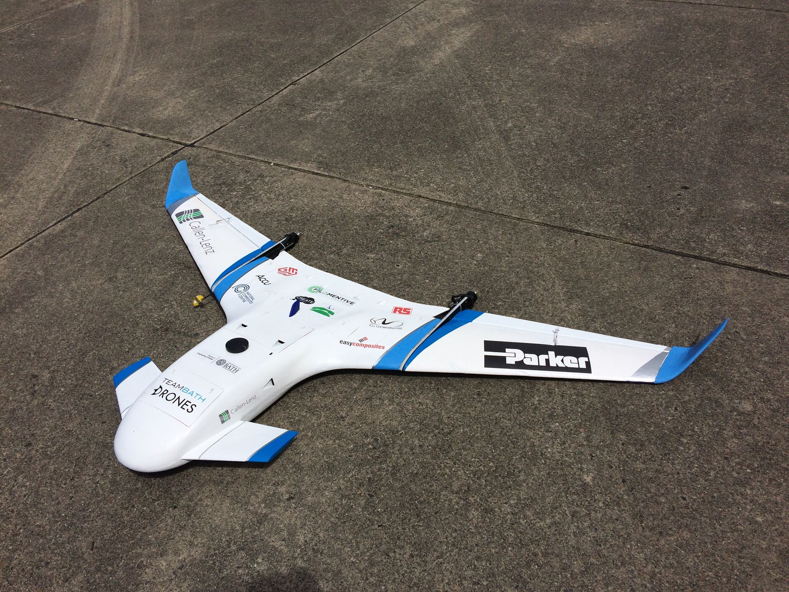

# DDPG_Drone
This is a my final year project to control a  tiltrotor UAV through its transition between horizontal and forward flight. 
The Simulink files are models in which the agent block sends control inputs to the flight dynamics model. The FDM outputs generate a reward and observations which are used to update the Agent neural networks.
The agent uses deep deterministic policy gradients which is an off policy actor cirtic algorithm which updates towards the gradient of the greatest reward. A useful resource for this is: T. P. Lillicrap, J. J. Hunt, A. Pritzel, N. Heess, T. Erez, Y. Tassa, D. Silver and D. Wierstra, “Continuous control with deep reinforcement learning,” CoRR, vol. abs/1509.02971, 2016.

The files represent 2 sections of the project, the tricopter.slx and .m files are a simplified RL model whose aim is to fly from A to B  in the least time possible. transition.slx and .m are a full transition model whose aim is to fly from A to B as fast as possible, where B is unreasonably far away. The best way to achieve this should be to transition and fly as a fixed wing, as this will give the highest speed. 

Supporting information can be found in the dissertation file which is my complete final year dissertation. Ultimately this never made it onto a physical aircraft but the simulation was made as accurate as reasonably possible for the aircraft shown below which was the Team Bath Drones aircraft of 2019.

The sub folder backup is my velocity controlled models which I based future models on. Towards the end of the project the agents would exploit weaknesses in the model such as limited aerodynamic modelling - this may happen with the files in the backup folder.

Yaw was always a nightmare and I never got it to work, if anybody uses this and gets yaw to work then please let me know how you did it I would love to have that solved!
